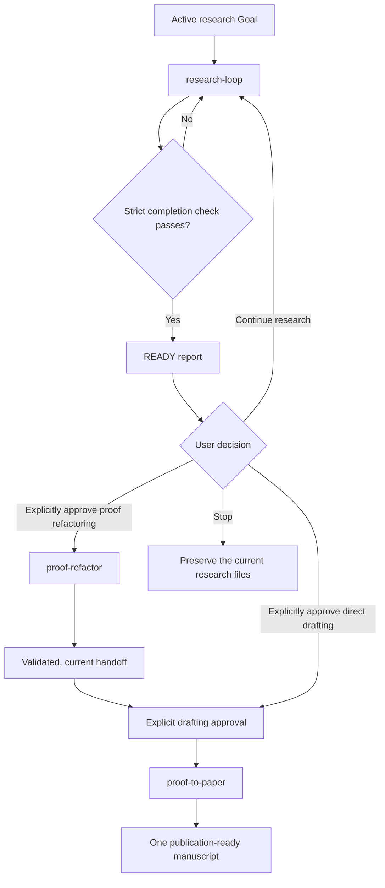

# Research Workflow Skills

English | [简体中文](README.zh-CN.md)

A small collection of Codex skills for long-running mathematical research,
from durable research memory to proof refactoring and paper drafting.
The workflow separates open-ended research, proof refinement, and manuscript production while preserving traceability between stages.

## Skills

| Skill | Purpose | Upstream dependency |
| --- | --- | --- |
| `research-loop` | Pursue an active research goal while keeping minimal file-backed memory. | None |
| `proof-refactor` | Turn a validated proof closure into a compact, locally checkable proof view. | `research-loop` |
| `proof-to-paper` | Convert a completed proof corpus or handoff into one publication-ready LaTeX manuscript. | Depends on input: none, `research-loop`, or `research-loop` plus `proof-refactor` |

Each skill lives in its own folder under [`skills/`](skills/). Install any
upstream dependency listed above with the skill that uses it. Start with
[`skills/research-loop/SKILL.md`](skills/research-loop/SKILL.md) for the overall
workflow.

## Workflow

The skills form a staged workflow:

1. `research-loop` develops and validates the research closure.
2. `proof-refactor` reorganizes a completed proof for local verification.
3. `proof-to-paper` converts the validated proof into manuscript form.



## Install locally

Copy only the skills you want into a project-local `.agents/skills` directory:

```bash
mkdir -p .agents/skills
cp -R skills/research-loop .agents/skills/
```

Or copy them into `$HOME/.agents/skills` to make them available across
projects.

## Initialize research memory

From any research project:

```bash
python3 /path/to/research-loop/scripts/research_graph.py \
  --root /path/to/research-project init
```

The command creates only `KEY_RESULTS.md`, `KEY_RESULTS.graph.json`, and
`RESEARCH_LOG.md`. It refuses to overwrite any existing file. Add `--dry-run`
to preview the paths.

## Test

The repository currently uses only the Python standard library:

```bash
python3 -m unittest discover -s skills/research-loop/tests -v
python3 -m unittest discover -s skills/proof-refactor/tests -v
python3 -m unittest discover -s skills/proof-to-paper/tests -v
```

The tests create temporary examples at runtime, so the repository does not
need a committed fixture directory.

## Trust boundary

The research graph validator checks claim identifiers, dependency cycles,
evidence paths, status rules, and review-digest freshness. The downstream
helpers check declared paths, file sets, and byte hashes. They do **not** prove
mathematical claims, validate citations, compile LaTeX, inspect PDFs, or
establish that an external program is safe. A human or trusted research process
must review the actual arguments, source hypotheses, reproduction commands,
and final manuscript.

## Status

Experimental. Interfaces and file formats may change while the workflow is
tested on real research projects.
