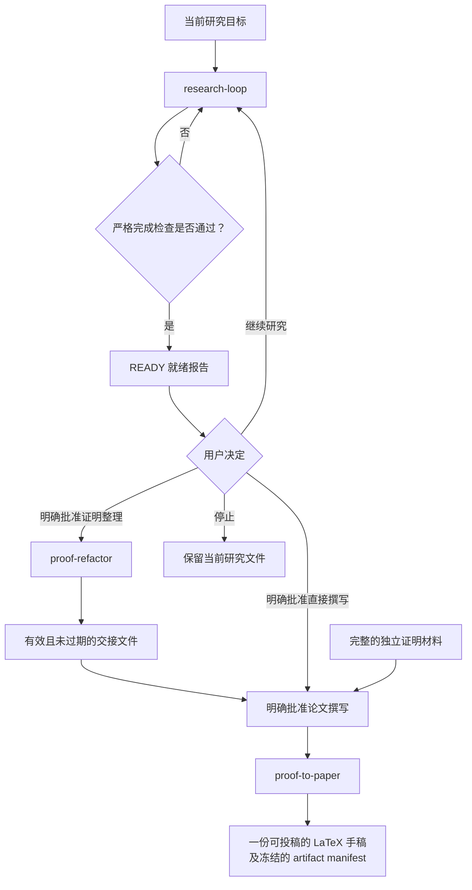

# 数学研究工作流 Skills

[English](README.md) | 简体中文

这是一组面向长期数学研究的轻量 Codex skills，覆盖持久化研究记忆、
证明重构和论文撰写。整个工作流将开放式研究、证明整理和论文生产分开，
同时保留各阶段之间的可追溯关系。

## Skills

| Skill | 用途 | 上游依赖 |
| --- | --- | --- |
| `research-loop` | 推进当前研究目标，同时维护最小化的文件记忆。 | 无 |
| `proof-refactor` | 将已经验证的证明及其依赖整理成紧凑、可局部核查的证明视图。 | `research-loop` |
| `proof-to-paper` | 将完整的证明材料或交接结果转换成一份可投稿的 LaTeX 手稿。 | 取决于输入：无、`research-loop`，或同时依赖 `research-loop` 与 `proof-refactor` |

每个 skill 都位于 [`skills/`](skills/) 下的独立目录中。安装某个 skill
时，也应安装上表列出的上游依赖。若要了解完整工作流，可以先阅读
[`skills/research-loop/SKILL.md`](skills/research-loop/SKILL.md)。

## 工作流

这些 skills 构成一个分阶段工作流：

1. `research-loop` 推进研究，并验证目标所需的关键结论及其依赖。
2. `proof-refactor` 将已完成的证明重新组织为便于局部核查的形式。
3. `proof-to-paper` 将已验证的证明转换成论文手稿。



## 本地安装

只将需要的 skills 复制到项目内的 `.agents/skills` 目录：

```bash
mkdir -p .agents/skills
cp -R skills/research-loop .agents/skills/
```

也可以将它们复制到 `$HOME/.agents/skills`，使其在不同项目中都可用。

## 初始化研究记忆

在任意研究项目中运行：

```bash
python3 /path/to/research-loop/scripts/research_graph.py \
  --root /path/to/research-project init
```

该命令只会创建 `KEY_RESULTS.md`、`KEY_RESULTS.graph.json` 和
`RESEARCH_LOG.md`，并拒绝覆盖任何已有文件。加入 `--dry-run` 可以预览
将要创建的路径。

## 测试

本仓库目前只使用 Python 标准库：

```bash
python3 -m unittest discover -s skills/research-loop/tests -v
python3 -m unittest discover -s skills/proof-refactor/tests -v
python3 -m unittest discover -s skills/proof-to-paper/tests -v
```

测试会在运行时创建临时示例，因此仓库不需要提交 fixture 目录。

## 信任边界

验证脚本只检查已声明研究记忆的结构与内部一致性，包括 claim ID、依赖环、
证据路径、状态规则和审阅摘要是否过期。它们**不能**证明数学命题，不能判断
引用来源是否正确，也不能保证外部程序安全。在将 claim 标记为 `Proved` 或
记录根摘要之前，仍需由研究者或可信研究流程核查实际论证、来源假设和复现命令。

## 状态

实验阶段。在使用真实研究项目进行测试期间，接口和文件格式仍可能调整。
